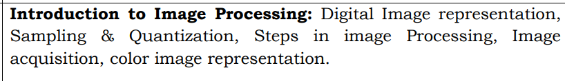

# 📌 Introduction to Image Processing
Before we start, let's think about something familiar. Imagine you take a photo using your phone. What happens? The camera captures the image, processes it, and stores in it your gallery.

Now, what if we want to:

✅ Make the image brighter or darker?

✅ Remove noise (like blurry parts or unwanted spots)?

✅ Detect objects in the image (like faces in a selfie)?

This is where `image processing` comes in! Image processing is all about manipulating images to improve them or extract useful information.

There are two types of image processing:
1. Analog Image Processing - Works with physical images (like old printed photos).

2. Digital Image Processing - Works with images stored in a computer or phone (JPEG, PNG, etc.).

Since we are dealing with computers, we will focus on Digital Image Processing (DIP).

# 📌 Digital Image Representation

🖼️ What is a Digital Image?

A digital image is nothing but a collection of tiny dots called pixels (short for "picture elements").

💡 Think of a digital image like a chessboard 🏁, where each square is a pixel. The more squares (pixels) you have, the clearer the image is.

## 📌 How is a Digital Image Stored?
A digital image is stored in the form of numbers in a grid. Each number represents the intensity (brightness) of a pixel.

For example, a 4x4 grayscale image can be represented like this:
Grayscale Image: Each pixel has a single intensity value (0-255).

```css
[  0   50  100  150 ]  
[ 30   80  130  180 ]  
[ 60  110  160  210 ]  
[ 90  140  190  255 ]
```
Here:

 0 = Completely black 🖤

 255 = Completely white 🤍

 Values in between represent different shades of gray.

Color Image: Each pixel has three values (Red, Green, Blue - RGB).

```lua
R = [[255, 0, 0],  [0, 255, 0],  [0, 0, 255]]
G = [[255, 255, 0],  [0, 255, 255],  [255, 0, 255]]
B = [[0, 255, 255],  [255, 0, 255],  [255, 255, 0]]
```

👉 Python Example: Read & Display an Image

```python
import cv2

image = cv2.imread("image.jpg")  # Load image
cv2.imshow("Original Image", image)
cv2.waitKey(0)
cv2.destroyAllWindows()
```

 # Sampling & Quantization

 When we convert a real-world image into a digital image, two important processes happen:

 ## 1️⃣ Sampling (Choosing Pixels)
 Imagine taking a group photo 📸.

    If you take a `high resolution` image, you capture more details.
    If you take a `low resolution` image, you capture fewer details.

    💡 Sampling is like deciding how many pixels to use in an image.
    More pixels = Better quality (but larger the file size)
    Fewer pixels = Poor quality (but smaller file size)

📌 Example:

    A 1080p image has `1920 x 1080` pixels (high sampling)
    A 240p image has `426 x 240` pixels (low sampling)

👉 Example of Sampling (Reducing Resolution)

```python
small_image = cv2.resize(image, (50, 50))  # Reduce size to 50x50 pixels
cv2.imshow("Low Resolution", small_image)
cv2.waitKey(0)
cv2.destroyAllWindows()
```

## 2️⃣ Quantization (Assigning Colors)

Now, let's talk about color levels.

    If you take a black-white photo, you only have 2 colors (black or white).
    If you take a grayscale photo, you can have 256 shades of gray.
    If you take a color photo, you have millions of colors.

💡 Quantization is like choosing how many colors an image can have.

    More colors = smoother image.
    Fewer colors = blocky image.

📌 Example:

    Old video games (like Mario 🎮) had very few colors (low quantization).
    Modern games (like GTA 🎮) have high color depth (high quantization).

👉 Example of Quantization (Reducing Color Depth)

```python
import numpy as np

quantized_image = np.round(image / 64) * 64  # Reduce color levels
cv2.imshow("Quantized Image", quantized_image.astype(np.uint8))
cv2.waitKey(0)
cv2.destroyAllWindows()
```

# 📌 Steps in Image Processing

When we process an image, we follow these steps:

    1️⃣Image Acquisition - Capture the image using a camera or scanner.

    2️⃣Preprocessing - Remove noise, adjust brightness/contrast.

    3️⃣Segmentation - Identify important parts (like detecting faces).

    4️⃣Feature Extraction - Pick out special details (like face recognition in your phone).

    5️⃣Image Recognition - Identify objects or patterns (like face recognition in your phone).

    6️⃣Storage & COmpression - Save the image efficiently (like JPEG, PNG).

👉 Example: Convert Image to Grayscale (Preprocessing)

```python
gray_image = cv2.cvtColor(image, cv2.COLOR_BGR2GRAY)
cv2.imshow("Grayscale Image", gray_image)
cv2.waitKey(0)
cv2.destroyAllWindows()
```

# 📌 Image Acquisition (How do we get digital images?)

Before processing an image, we first need to capture it. This is called image acquisition.

    Examples of image acquisition:
    ✔️Taking a photo with a mobile camera 📱
    ✔️Scanning a document using a scanner 🖨️
    ✔️Capturing an X-ray image at a hospital 🏥

    💡 The quality of an image depends on:
    ✔️ The resolution of the camera 📷 (More megapixels = better details)
    ✔️ The lighting conditions (Low light = grainy images).
    ✔️ The sensor quality of the camera.

👉 Example: Load Image in Python

```python
image = cv2.imread("image.jpg")
cv2.imshow("Loaded Image", image)
cv2.waitKey(0)
cv2.destroyAllWindows()
```

👉 Example: Capture Image from Webcam

```python
cap = cv2.VideoCapture(0)  # Open webcam
ret, frame = cap.read()  # Capture frame
cv2.imshow("Webcam Image", frame)
cv2.waitKey(0)
cap.release()
cv2.destroyAllWindows()
```

# Color Image Representation 

Until now, we talked about grayscale images (black & white images). But most images are colored.

## 🎨 How do we represent colors?

Every color image is made up of three basic colors:

    1️⃣ Red (R)
    2️⃣ Green (G)
    3️⃣ Blue (B)

💡 These three colors combine to create all other colors (just like mixing paints). This is called the RGB model.

📌 Example:

    Pure Red = (255, 0, 0)
    Pure Green = (0, 255, 0)
    Pure Blue = (0, 0, 255)
    White = (255, 255, 255)
    Black = (0, 0, 0)
    Yellow = (255, 255, 0) 

If you zoom into a colored image, you will see tiny Red, Green, and Blue dots forming different colors. This is how digital screens work! 📺

👉 Example: Extract Red, Green, and Blue Channels

```python
B, G, R = cv2.split(image)  # Split color channels

cv2.imshow("Red Channel", R)
cv2.imshow("Green Channel", G)
cv2.imshow("Blue Channel", B)
cv2.waitKey(0)
cv2.destroyAllWindows()
```

👉 Example: Convert RGB to HSV (Hue, Saturation, Value)

```python
hsv_image = cv2.cvtColor(image, cv2.COLOR_BGR2HSV)
cv2.imshow("HSV Image", hsv_image)
cv2.waitKey(0)
cv2.destroyAllWindows()
```

# Summary (Key Takeaways)

    📌 Digital Image = Collection of tiny pixels an image should have.
    📌 Sampling = Choosing how many pixels an image should have.
    📌 Quantization = Deciding how many color levels to use.
    📌 Steps in Image Processing = Acquisition ➝ Preprocessing ➝ Segmentation ➝ Feature Extraction ➝ Recognition ➝ Storage.
    📌 Color Images use RGB (Red, Green, Blue) to create all colors.

